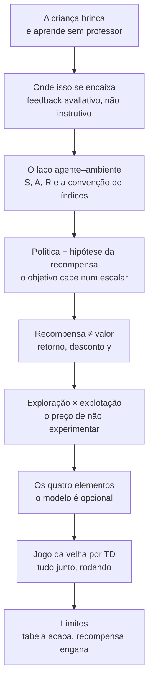

# Guia de condução — Aula 01 · Introdução ao aprendizado por reforço

Guia do professor para ministrar a aula que vai da *criança que brinca* até o
*jogo da velha aprendido por diferenças temporais*. Material de apoio:
[`aula.html`](./aula.html) (projetar; tecla `P` entra no modo apresentação),
[`README.md`](./README.md) (referência escrita) e [`scripts/`](./scripts/).

Planejamento para **~100 min** (duas aulas geminadas). No fim há uma versão
reduzida para 50 min.

---

## O arco da aula

Não é uma lista de tópicos. É **uma distinção que se constrói devagar e paga no
fim**: recompensa não é valor. Tudo converge para isso, e o jogo da velha é a
prova viva.

A frase que amarra tudo, e que vale repetir três vezes:

> **A recompensa vem do ambiente e é imediata. O valor é uma previsão do agente
> sobre o futuro. Decidimos sobre o valor.**

Ela aparece no § 05 (definição), volta no § 07 (elementos) e fecha no § 08
(a tabela V do jogo da velha *é* isso, visível na tela).

---

## Checklist antes de entrar

- [ ] Abrir `aula.html` e apertar `P` uma vez para confirmar que a tela cheia
      dispara nesse computador. São **44 slides**; use `←` e `→` para navegar.
- [ ] Os blocos com **+** são detalhe opcional: só abra se a turma perguntar.
      O texto completo está no `README.md`.
- [ ] Rodar a demo do bandit (§ 06) uma vez para "esquentar" — ela leva alguns
      segundos e é melhor que o primeiro clique não seja em aula.
- [ ] Deixar o jogo da velha (§ 08) **zerado**: a graça é treinar ao vivo.
- [ ] Tema claro ou escuro conforme a luz da sala (botão na barra lateral).
- [ ] Ter o link da atividade e do repositório prontos para postar.
- [ ] Se for usar as animações do Manim, renderizar **antes** (leva minutos).

---

## Roteiro

| Min | Bloco | O que fazer |
|----:|-------|-------------|
| 0–8 | **Abertura** | A pergunta-isca (abaixo). Sem slide ainda. |
| 8–16 | § 01–02 | A criança, a figura do Lapan, a tabela dos três paradigmas |
| 16–30 | § 03 | O laço, a notação, a convenção de índices + demo do corredor |
| 30–40 | § 04 | Política determinística × estocástica, hipótese da recompensa |
| 40–58 | § 05 | **Retorno, desconto, valor** + demo do γ + exercício 1 |
| 58–70 | § 06 | Exploração × explotação + demo do bandit |
| 70–76 | § 07 | Os quatro elementos, model-free × model-based |
| 76–92 | § 08 | Jogo da velha — **treinar ao vivo** |
| 92–100 | § 09–11 | Limites, história em três fios, síntese, atividades |

---

## Bloco a bloco

### Abertura (0–8) — a pergunta-isca

Antes de qualquer slide, no quadro:

> **"Como você ensinaria um robô a andar, sem nunca mostrar a ele um exemplo de
> alguém andando?"**

Deixe a turma tentar. Vão aparecer três tipos de resposta, e as três são úteis:

- *"programaria as regras"* → você não sabe as regras; é por isso que o problema existe.
- *"treinaria com exemplos de movimentos certos"* → é aprendizado supervisionado,
  e exige alguém que já saiba a resposta.
- *"deixaria tentar e diria se está indo bem"* → **é isso**. E é só isso que temos.

Feche: "essa terceira resposta é a disciplina inteira. O resto do semestre é
descobrir o que 'está indo bem' significa matematicamente, e como um algoritmo
usa esse número."

### § 01–02 (8–16) — a criança e os três paradigmas

Rápido. O único ponto que precisa ficar: no diagrama do Lapan voltam **duas**
setas do ambiente — observações e recompensa. É a segunda que muda tudo.

Na tabela dos três paradigmas, o item que merece pausa é a **distribuição dos
dados**:

> **"Em aprendizado supervisionado, o conjunto de treino muda quando o modelo
> melhora?"**

Não. Aqui, muda — o agente melhora, visita outros estados, e o conjunto de dados
que ele mesmo gera passa a ser outro. Diga que boa parte da dificuldade prática
de RL vem daí.

⚠️ *Onde travam:* a turma tende a ouvir "RL é supervisionado com recompensa no
lugar do rótulo". Não é. Rótulo diz **qual era a ação certa**; recompensa diz
apenas **quão boa foi a que você fez** — e nada sobre as outras. É a diferença
entre feedback instrutivo e avaliativo, e ela é a origem do § 06.

### § 03 (16–30) — o laço e a notação

O slide da sequência `S₀ A₀ R₁ S₁ A₁ R₂ …` merece ser lido em voz alta,
apontando com o dedo. Depois pergunte:

> **"A recompensa da ação A₅ é R₅ ou R₆?"**

Metade vai errar. Aproveite: o índice marca **quando o número chegou**, junto com
o próximo estado. Escreva no quadro `A_t → (R_{t+1}, S_{t+1})` e mande copiar.

Na **fronteira agente–ambiente**, use o robô da sala (ou o exemplo do braço da
disciplina de robótica): os motores são do ambiente, não do agente. O critério é
"o agente controla isto arbitrariamente?".

Na **demo do corredor**, conduza assim:

1. Clique em "Dar um passo" **umas seis vezes, devagar**, lendo a fita da
   trajetória em voz alta: "S três, ação para a direita, recompensa menos um,
   S quatro".
2. Troque para "Sempre à direita" e clique em automático. Compare a soma.
3. Pergunte: **"o agente aleatório é burro?"** Não — ele apenas não tem nenhuma
   estimativa de valor. Ainda não demos isso a ele.

### § 04 (30–40) — política e hipótese da recompensa

A política estocástica costuma gerar a pergunta "por que eu iria querer agir ao
acaso?". Guarde a resposta para o § 06 e diga que vai guardar — a turma fica
esperando.

A **hipótese da recompensa** é o momento filosófico da aula. Vale 3 minutos:

> **"Tudo o que vocês querem de um sistema cabe num único número por instante?"**

Deixe reclamarem. As objeções são boas (segurança, múltiplos objetivos,
preferências que não se comparam) e todas voltam mais adiante no curso. O ponto
é que **aceitar essa hipótese é o que define o campo**.

Feche com o erro clássico de projeto (o aspirador que fica esbarrando no lixo).
Peça um exemplo da própria turma antes de mostrar os do slide.

### § 05 (40–58) — o coração da aula

Não corra aqui. É o bloco que a aula existe para entregar.

Ordem sugerida:

1. Escreva `G_t` no quadro **antes** de projetar o slide. Pergunte o que acontece
   com a soma se a tarefa nunca acaba. Aí γ aparece como necessidade, não como
   truque.
2. Projete as definições de `v` e `q`.
3. **Demo do γ.** Comece com γ = 0,9 e vá **baixando** devagar. Deixe a turma
   ver a barra da direita encolher e a preferência virar. Pergunte antes de
   chegar lá: **"em que γ elas empatam?"**
4. Faça o exercício 1 no quadro (γ = 1/√10 ≈ 0,316).
5. Mexa em "passos até o prêmio" e deixe a turma prever se o γ crítico sobe ou
   desce. (Sobe: prêmio mais longe exige mais paciência.)

⚠️ *Onde travam (o erro do semestre inteiro):* trocar recompensa por valor.
Escreva os dois no quadro, lado a lado, e deixe lá até o fim da aula:

| | vem de | quando | precisa ser aprendido? |
|---|---|---|---|
| recompensa `R` | ambiente | agora | não |
| valor `v`, `q` | agente | previsão do futuro | **sim** |

⚠️ Segundo erro: escrever `v(s,a)`. Se aparecer no quadro de alguém, corrija na
hora — `v` é do estado, `q` é do par.

### § 06 (58–70) — exploração × explotação

Agora responda a pergunta guardada do § 04: **é para isso que serve agir ao acaso.**

Antes de rodar a demo, faça a votação:

> **"Quem explora 10% do tempo para sempre vai ganhar mais ou menos, no total, do
> que quem nunca explora?"**

Colha as mãos. Aí rode. O guloso puro (ε = 0) estaciona por volta de 1,0 e
ε = 0,1 chega perto de 1,4 — a exploração **se paga**, mesmo cobrando pedágio.
Mostre também ε = 0,01: aprende devagar e ultrapassa depois. Conclusão a dizer em
voz alta: **não existe ε ótimo universal; existe ε adequado ao horizonte.**

Se sobrar tempo, mexa no ε ajustável até 0,5 e mostre que explorar demais é tão
ruim quanto não explorar.

### § 07 (70–76) — os quatro elementos

Rápido, é consolidação. O único ponto novo é **o modelo ser opcional**, e a nota
sobre métodos evolutivos (por que buscar políticas inteiras *não* é RL: joga
fora a informação de quais estados foram visitados dentro da partida).

### § 08 (76–92) — jogo da velha ao vivo

O melhor momento da aula. Conduza como demonstração, não como slide:

1. Explique a montagem (afterstates, tabela V, valores terminais) — 3 min.
2. **Antes de treinar**, aponte o tabuleiro de aberturas: tudo em 0,50. "O agente
   não sabe nada. Nem que o centro é bom. Nem as regras de quem joga bem."
3. Clique em **Treinar**. Deixe a curva subir em silêncio por uns 15 segundos.
4. Volte ao tabuleiro de aberturas: os números se separaram. **Ele descobriu.**
5. Agora os três experimentos do slide, nesta ordem:
   - `ε = 0` → a taxa de vitória até melhora, **mas oito casas continuam em
     0,50**. É o argumento mais forte da aula a favor da exploração, e é visual.
   - "aprender com jogadas exploratórias" → as derrotas sobem um pouco; explique
     que ele passou a estimar o valor da política *com* as jogadas aleatórias.
   - perícia do oponente = 100% → vitórias vão a zero, empates dominam, e **todas
     as aberturas voltam para 0,50** (todas empatam). Diga que é exatamente o que
     minimax daria — e que por isso minimax é inútil contra um adversário fraco.

⚠️ *Onde travam:* "por que ele joga contra ele mesmo?" — não joga. Joga contra um
oponente fixo e imperfeito. Autojogo é outra coisa (TD-Gammon, AlphaZero), e vale
citar como o que veio depois.

⚠️ Pergunta que sempre aparece: **"e se o tabuleiro fosse maior?"** É a deixa
perfeita para o § 09: 3⁹ cabe numa tabela, 10¹⁷⁰ não. Toda a segunda metade do
curso é sobre isso.

### § 09–11 (92–100) — limites, história, fecho

Corra pelos limites (cada um vira uma aula) e pela linha do tempo. Se o tempo
apertar, **corte a história**, nunca o § 05 ou o § 08.

Feche voltando à pergunta da abertura: "o robô que anda. Agora vocês sabem o que
falta especificar: o estado, as ações, a recompensa — e sabem que a última é a
mais perigosa."

Passe as atividades e o link do repositório.

---

## Perguntas que a turma faz (e boas respostas curtas)

**"RL é o que faz o ChatGPT funcionar?"**
Em parte. O modelo de linguagem é treinado de forma supervisionada; o
alinhamento com preferências humanas (RLHF) usa RL, com um modelo de recompensa
treinado para imitar julgamentos de pessoas. Está no § 10.

**"Por que γ e não simplesmente somar tudo?"**
Duas razões: em tarefas que não terminam a soma pode divergir; e γ é a maneira
mais simples de dizer "prefiro o resultado mais cedo". Em tarefas episódicas
γ = 1 é permitido.

**"Como escolher γ?"**
É do projetista, e é uma escolha sobre **o problema**, não sobre o algoritmo.
Regra de bolso: γ = 0,99 dá um horizonte efetivo da ordem de 1/(1−γ) = 100
passos. Se as consequências que importam estão a 500 passos, γ = 0,9 não serve.

**"Isso não é só otimização?"**
É otimização, mas com duas complicações que a otimização clássica não tem: a
função objetivo só é acessível por amostragem, e os dados dependem da solução
atual.

**"Preciso saber deep learning para esta disciplina?"**
Não para a primeira metade — ela é tabular, e dá para provar convergência. Para a
segunda metade, sim.

---

## Versão de 50 minutos

Se a aula for única, mantenha o eixo e sacrifique o resto:

| Min | Bloco |
|----:|-------|
| 0–5 | Abertura (a pergunta-isca) |
| 5–12 | § 03 — o laço e a convenção de índices (com a demo do corredor, 3 passos só) |
| 12–18 | § 04 — política e hipótese da recompensa |
| 18–30 | § 05 — retorno, γ, valor + demo (**não cortar**) |
| 30–38 | § 06 — exploração × explotação + demo do bandit |
| 38–47 | § 08 — jogo da velha ao vivo (treinar + ε = 0) |
| 47–50 | Síntese e atividades |

Cortados: § 01–02 (viram leitura no `README.md`), § 07, § 09 e § 10.

---

## Depois da aula

- Postar o link de `aula.html` e do `README.md`.
- A Atividade 1 (Gymnasium) é o pré-requisito prático da aula 02 — cobre.
- Quem quiser se adiantar: capítulo 1 do Sutton & Barto inteiro (são 12 páginas)
  e capítulo 2 do Lapan (instalação e primeiro ambiente).
