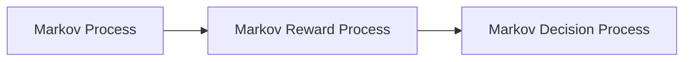
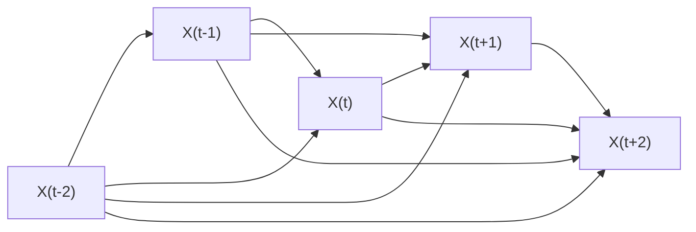
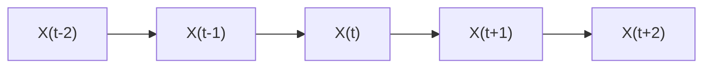
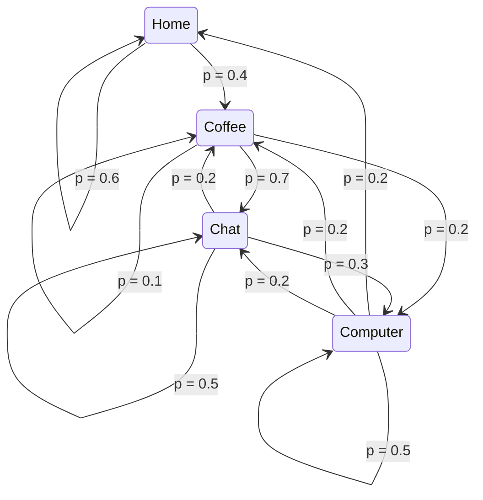
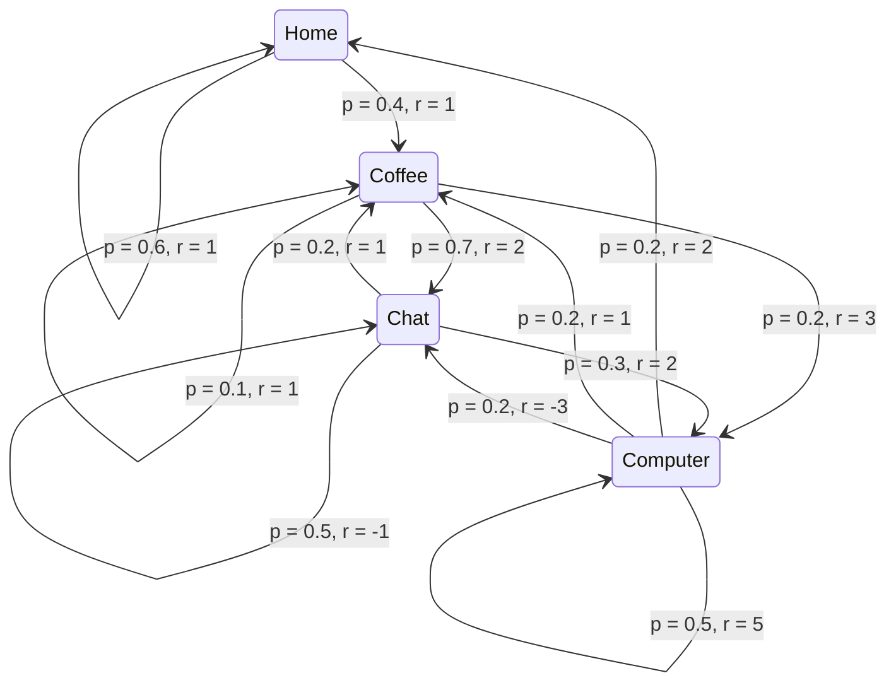
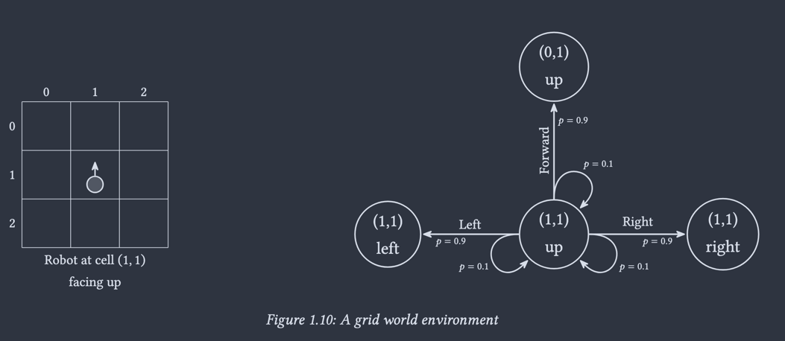

Vamos entrar agora na última rodada de fundamentação teórica para a área de aprendizado por reforço.
Como apresentado no livro _Deep Reinforcement Learning Hands-on: A Practical and Easy-to-follow Guide to RL from Q-learning and DQNs to PPO and RLHF_ (Lapan, M. 2024), vamos apresentar o conceito de processo de decisão de Markov como uma [boneca matryoshka](https://www.macalester.edu/russian-studies/about/resources/miscellany/matryoshka/).

# Processo de Markov

É estudado em outras áreas da computação e da matemática (inclusive no livro de Álgebra Linear e Aplicações, do Howard Anton).

Imagine que você está tentando modelar a dinâmica de um sistema o qual você pode apenas observar. O que você pode observar são chamados estados ($s \in \mathcal{S}$) que o sistema transita de acordo com uma lei dinâmica (geralmente desconhecida para você).

Sua observação forma uma sequência (finita, mas podendo ser extremamente grande) de estados discretos, ou cadeia (por isso cadeias de Markov).

Considere a sequência:

De forma que modelamos a dinâmica de transição de um estado para outro em cima da probabilidade condicional:

$$P(X_t | X_{0:t-1})$$

A premissa de Markov (_Markov Assumption_) de um processo de Markov de primeira ordem diz que o último estado deve fornecer informação suficiente da dinâmica para calcular a probabilidade do próximo estado. Ou seja:

$$P(X_t | X_{0:t-1}) = P(X_t | X_{t-1})$$

💡A probabilidade deve seguir os [Axiomas de Kolmogorov](https://en.wikipedia.org/wiki/Probability_axioms).

💡Podemos tentar forçar essa propriedade, em um cenário complexo, expandindo o espaço de estados. Tentando levar em conta atrasos e dependências do modelo... mas com custo computacional. 

> Definição (Howard Anton): Se uma cadeia de Markov tiver $k$ estados possíveis, que identificamos por $1,2,\dots,k$, então a probabilidade de o sistema estar no estado $i$ em qualquer observação se na observação imediatamente precedente estava no estado $j$, é denotada por $p_{ij}$ e é denominada **probabilidade de transição** do estado $j$ ao estado $i$. A matriz $P = [p_{ij}]$ é denominada **matriz de transição** da cadeia de Markov.

❗️No livro de Deep Reinforcement Learning, o autor usa uma notação levemente diferente, sendo a transposta! "A matriz de transição, que é uma matriz quadrada $N \times N$, em que $N = | \mathcal{S} |$ é o número de estados do nosso modelo. Toda célula representa a probabilidade do sistema transitar do estado $i$ (linha) para o estado $j$ (coluna).". Além disso, a matriz de transição é denominada $T$.

> Definição (Howard Anton): O vetor estado de uma observação de uma cadeia de Markov com $k$ estados é um vetor coluna $x$ cujo $i$-ésimo componente $x_i$ é a probabilidade do sistema estar, naquela observação, no $i$-ésimo estado.

> Teorema (Howard Anton): Se $P$ for a matriz de transição de uma cadeia de Markov e $x^{(n)}$ o vetor estado na enésima observação, então $x^{(n+1)} = P x^{(n)}$.

❗️Usando a convenção do Lapan, M. ficaria $x^{(n+1)} = T^\top x^{(n)}$

A partir de agora, vamos usar apenas a convenção do Lapan, M.!

---

Vamos implementar um *toy-example* em que se modela a dinâmica de uma loja de aluguel de carros. Pegamos dados históricos de locação e devolução de carros, e montamos a seguinte matriz de (proposta de) dinâmica de transição:

$$T = \begin{bmatrix}0.8 & 0.1 & 0.1 \\ 0.3 & 0.2 & 0.5 \\ 0.2 & 0.6 & 0.2 \end{bmatrix}$$

Supondo que todos os carros começam na loja 2. Como deve ficar na 3ª iteração, e na 10ª, e na 100ª?

💡Existe uma "manha" usando autovalores e autovetores...

---

Um exemplo mais interessante é o do _Office Worker_ (Dilbert, o cartoon):

O espaço de estados está descrito a seguir (o número é o índice do estado):

1. Home: He’s not at the office
2. Coffee: He’s drinking coffee at the office
3. Chat: He’s discussing something with colleagues at the office 
4. Computer: He’s working on his computer at the office

Recebemos as seguintes observações, a partir de um tempo de captura:

- Home → Coffee → Coffee → Chat → Chat → Coffee → Computer → Computer → Home
- Computer → Computer → Chat → Chat → Coffee → Computer → Computer → Computer
- Home → Home → Coffee → Chat → Computer → Coffee → Coffee
- ...

Com isso, contamos todas as transições provenientes de cada estado, normalizamos para que a soma dê 1 e, com isso, montamos uma matriz de transição a seguir:

$$T = \begin{bmatrix}0.6 & 0.4 & 0.0 & 0.0 \\ 0.0 & 0.1 & 0.7 & 0.2 \\ 0.0 & 0.2 & 0.5 & 0.3 \\ 0.2 & 0.2 & 0.1 & 0.5 \end{bmatrix}$$

Podemos visualizar com o seguinte grafo:

> t’s also worth noting that the Markov property implies stationarity (which means, the underlying transition distribution for any state does not change over time). Non-stationarity means that there is some hidden factor that influences our system dynamics, and this factor is not included in observations. However, this contradicts the Markov property, which requires the underlying probability distribution to be the same for the same state regardless of the transition history.

Agora vamos expandir essa notação...

# Processo de Recompensa de Markov

Para introduzir o conceito de recompensa, precisamos adicionar um valor para a transição de estado a outro estado. 

⚠️ Apesar de já ter probabilidade, ela está sendo usada para modelar a dinâmica da transição.

A forma mais geral é trazer uma outra matriz quadrada, de dimensões similares à matriz de transição de estados. Agora, um valor de recompensa é dado pela transição do estado $i$ (linha) ao estado $j$ (coluna).

💡A recompensa pode ser positiva, negativa, grande ou pequena, desde que seja um valor escalar.

Observando uma cadeira de estados, para cada transição temos, além da probabilidade, uma quantidade escalar (recompensa). Para cada episódio de observação, vamos definir o retorno para o tempo $t$ como $G_t$, considerando um desconto $\gamma$:

$$G_t = R_{t+1} + \gamma R_{t+2} + \dots = \sum_{k=0}^\infty \gamma^k R_{t+k+1}$$

Enquanto $\gamma = 0$ representa um agente com visão limitada para o próximo valor de recompensa (um tanto guloso), o outro extremo $\gamma$ só é aplicável em episódios finitos e curtos. 

💡Geralmente vemos $\gamma$ entre $0.9$ e $0.99$.

Em cima das várias observações, $G_t$ pode variar para o mesmo estado, então uma formulação mais útil pode ser pegar a média (valor esperado) de retorno adquirido para um determinado estado, essa expectativa matemática introduz o conceito de **valor do estado**:

$$v(s) = \mathbb{E}[G_t \mid S_t = s]$$

O material da disciplina definiu algumas recompensas para as transições:

- Home → Home: 1 (as it’s good to be home)
- Home → Coffee: 1
- Computer → Computer: 5 (working hard is a good thing)
- Computer → Chat: −3 (it’s not good to be distracted)
- Chat → Computer: 2
- Computer → Coffee: 1
- Computer → Home: 2
- Coffee → Computer: 3
- Coffee → Coffee: 1
- Coffee → Chat: 2
- Chat → Coffee: 1
- Chat → Chat: -1 (long conversations become boring)

A visualização em grafo fica:

Considerando o imediatismo de $\gamma = 0$, podemos usar a média ponderada pelas probabilidades para calcular o $v(s)$ de cada estado.
Qual é o estado mais valorizado entre as opções, neste caso?

Já no caso $\gamma = 1$, como não temos sumidouros (*sink states*), todos os estados tem valor infinito. Por isso $0 < \gamma < 1$ nos dá um horizonte prático.

# Processo de Decisão de Markov

Vamos agora considerar o conjunto de ações $\mathcal{A}$. Assim, nossa matriz de transição terá mais uma dimensão, assumindo um formato "cubóide" $|\mathcal{S}| \times |\mathcal{S}| \times |\mathcal{A}|$.

Nosso agente não apenas observa transições de estados, mas também escolhe ações que afetam as probabilidades de transição.

O formato do cubóide será estado origem pela altura $i$, estado objetivo pela largura $j$ e ação do agente pela profundidade $k$. Cada célula terá uma probabilidade.

💡Ações geralmente afetam probabilidades de transição de estados, ao invés de alterar deterministicamente o estado para considerar situações realistas, como imperfeições do sistema, instrumentação, deslizamento de rodas de motor de um robô... 

> In Figure 1.10, a small part of a transition diagram is shown, displaying the possible transitions from the state  (1, 1), up, when the robot is in the center of the grid and facing up. If the robot tries to move forward, there  is a 90% chance that it will end up in the state (0, 1), up, but there is a 10% probability that the wheels will slip and the target position will remain (1, 1), up.
> 

Além disso, vamos fazer o mesmo procedimento com a recompensa, que será em uma matriz no formato cubóide também, de dimensões $|\mathcal{S}| \times |\mathcal{S}| \times |\mathcal{A}|$.

📚(Sutton) A propriedade de Markov vai aparecer no laço que descreve a dinâmica:

$$P(R_{t-1} = r, S_{t+1} = s' | S_0, A_0, R_1, \dots, S_{t-1}, A_{t-1}, R_t, S_t, A_t) = P(R_{t-1} = r, S_{t+1} = s' | S_t, A_t)$$

Com essa base, podemos introduzir o conceito mais importante de MDP para RL, política (_policy_).

## Política

> The simple definition of policy is that it is some set of rules that defines the agent’s behavior.

Políticas diferentes podem prover quantidades diferentes de retorno, sendo que a otimização do retorno é o grande objetivo de RL.

Formalmente, a política é definida pela distribuição de probabilidade sob as ações de todo estado possível:

$$\pi(a | s) = P[A_t = a | S_t = s]$$

Como chegamos a ver rapidamente na introdução, a política afeta a computação das funções valor-estado e valor-ação:

$$ v_\pi(s) = \mathbb{E}_\pi[G_t \mid S_t = s] \qquad q_\pi(s,a) = \mathbb{E}_\pi[G_t \mid S_t = s, A_t = a] $$

📚(Sutton) A fundamental property of value functions used throughout reinforcement learning and dynamic programming is that they satisfy particular recursive relationships. For any policy π and any state s, the following consistency condition holds between the value of s and the value of its possible successor states:
$$v_\pi(s) = \mathbb{E}_\pi[G_t \mid S_t = s] = \sum_{a} \pi(a | s) \sum_{s',r} p(s',r|s,a) [r + \gamma v_\pi(s')]$$

Essa equação é conhecida como Equação de Bellman para $v_\pi$. Ela representa a relação entre o valor do estado e os valores dos estados sucessores.